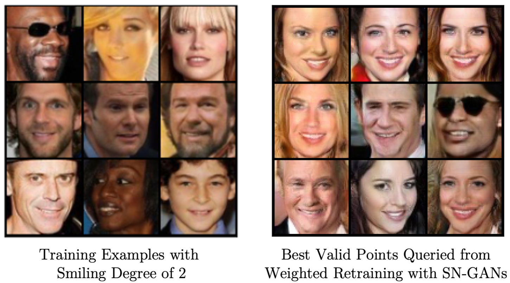

# Latent Space Optimization via Weighted Retraining of Deep Generative Models with Application on Image Data

  

## Description

Official code repository for the master's thesis _Latent Space Optimization via Weighted Retraining of Deep Generative Models with Application on Image Data_, submitted to the Chair in Mathematical Optimization (Prof. Dr. Claudia Schillings) and the Data and Web Science Group (Prof. Dr.-Ing. Margret Keuper) at the University of Mannheim.

The code in this repository is primarily intended for the following purposes:
1. All used deep generative models (VAE, RAE, VQ-VAE, SN-GAN) can be trained from scratch.
2. All weighted retraining experiments can be re-run (using provided pretrained models or custom-trained models).

## How to run

All code was designed to be run on a single GPU using Google Colab. For that, this repository can simply be copied to Google Drive. Then, the notebooks found under `notebooks` can be executed to reproduce the results of the thesis without the need of installing further dependencies.

### Set up Data

Data can be downloaded using the following link: https://drive.google.com/drive/folders/12mSO8DsnBUBvsV0_zfJrHfpsyI3Vp-iw?usp=sharing.

The folder `data` should then be uploaded to the Google Drive root directory of this repository.
For MNIST, all used data is provided. For CelebA, a relevant sample is included in zipped form.

### Training Models

**Note:** This section is optional, since pretrained models for all experiments are provided under `logs/train`.

To train each type of model:

1. Optionally adapt parameters for a model under `script/models`.
2. Run respective cells in the `pretrain` notebooks under `notebooks` to train the model.

The default parameters for all models are the ones used in the thesis. Due to different implementations of random seeds on different systems, you may not get the exact same results.

### Run Weighted Retraining Experiments

**Note:** This section is optional, since all results are provided under `logs/opt`.

To run the core weighted retraining experiments:

1. Optionally adapt parameters for an experiment under `script/opt`.
2. Run respective cells in the `opt` notebooks under `notebooks` to train the model.

The most important parameters are:

- `--pretrained_model_file` is the path to the saved starting model
- `--query_budget` controls the budget of function evaluations
- `--rank_weight_k` controls the degree of weighting (see paper for the exact definition)
- `--retraining_frequency` controls the retraining frequencies (number of epochs between retrainings)
- `--result_root` is the directory to save the results in
- `--opt_constraint_strategy` is the strategy to constrain LSO with. Can be `gmm_full` or `gmm_fit` (then, `n_gmm_components` has to be provided) for VAE experiments, `gmm_fit` for RAE experiments and `discriminator` for SN-GAN experiments.
- `--opt_constraint_strategy` is the chosen threshold value that defines the optimization constraint. Represents the log-density threshold for GMM-constraints if `gmm_full` or `gmm-fit` strategy is chosen, and the fraction of sample points to reject (w.r. to discriminator score) if "discriminator" strategy is chosen.

The default parameters for all experiments can be chosen to reproduce the results reported in the thesis, using the provided pretrained models.
Note that experiments on CelebA and MNIST (m=16) will take a long time to finish (approximately 3 hours). Due to different implementations of random seeds on different systems, you may not get the exact same results.

## Credits

- Thanks to the authors of [Sample-Efficient Optimization in the Latent Space of Deep Generative Models via Weighted Retraining](https://github.com/cambridge-mlg/weighted-retraining) for providing their implementations, which the code in this repository is based on.
- Thanks to the authors of [ENTMOOT](https://github.com/cog-imperial/entmoot) for providing their implementation of Bayesian optimization using tree-based models, which we based our weighted retraining experiments with VQ-VAEs on.
